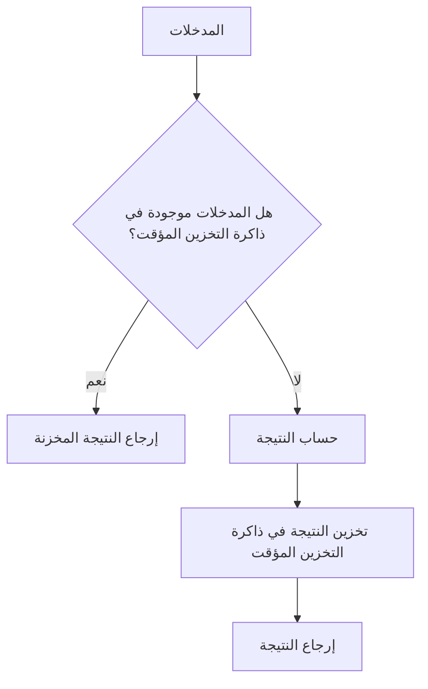
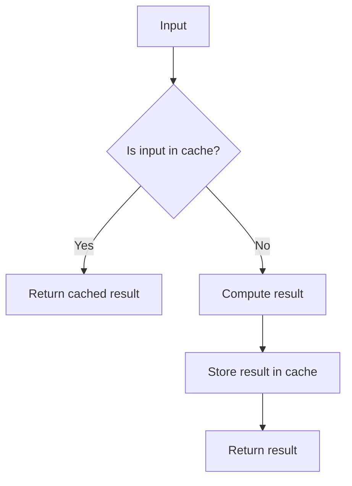

# الاستظهار (Memoization)

في الحوسبة، الاستظهار (بالإنجليزية: memoization) هي 
تقنية تحسين تستخدم في المقام الأول لتسريع برامج الحاسوب عن طريق تخزين نتائج استدعاءات الدوال **باهظة الثمن** وإرجاع النتيجة المخزنة مؤقتًا عند حدوث نفس المدخلات مرة أخرى



## شرح
- **المدخلات**: القيم التي تدخل إلى الدالة
- **التحقق من وجود المدخلات في ذاكرة التخزين المؤقت**: البحث في ذاكرة التخزين المؤقت (كائن أو خريطة) لمعرفة ما إذا كانت النتيجة لهذه المدخلات محسوبة مسبقًا
- **إرجاع النتيجة المخزنة**: إذا كانت موجودة، يتم إرجاع النتيجة المخزنة دون إعادة الحساب
- **حساب النتيجة**: إذا لم تكن موجودة، تقوم الدالة بحساب النتيجة
- **تخزين النتيجة في ذاكرة التخزين المؤقت**: بعد الحساب، يتم تخزين النتيجة في ذاكرة التخزين المؤقت للمدخلات المعطاة
- **إرجاع النتيجة**: إرجاع النتيجة المحسوبة

## مثال
```javascript
const cache = {};

function memoizedFunction(input) {
  if (cache[input]) {
    return cache[input]; // إرجاع النتيجة المخزنة
  }
  
  const result = expensiveCalculation(input); // حساب النتيجة
  cache[input] = result; // تخزين النتيجة
  return result; // إرجاع النتيجة
}
```

## مثال ٢

```typescript

// CODE EXAMPLE

// مهمه ١
// اكتب دالة times10 تأخذ رقم n
// وضربه في 10 
const times10 = (n: number) => n * 10; 


const cache: { [key: number]: number } = {};
// اكتب في كائن 
// cache
// لتخزين النتائج
const memoTimes10 = (n: number) => { 
  // مهمه ٢
  // التحقق من وجود المدخلات في ذاكرة التخزين المؤقت
  if(cache[n]) {
    console.log('جلب القيمة المخزنة لـ', n);
    return cache[n]
  } else {
    let value = times10(n);
    cache[n] = value;
    console.log('تم حساب القيمة لـ', n);
    return value;
  }
}

console.log('times10 of 9', times10(9));
console.log('memoTimes10 of 9', memoTimes10(9));
console.log('memoTimes10 of 9 again', memoTimes10(9));
```

## English Version
In computing, memoization is an optimization technique used primarily to speed up computer programs by storing the results of **expensive function calls** and returning the cached result when the same inputs occur again.



## Explanation
- **Input**: Values passed to the function
- **Check if input exists in cache**: Look in the cache (object or map) to see if the result for these inputs has been previously computed
- **Return cached result**: If found, return the stored result without recomputing
- **Compute result**: If not found, the function computes the result
- **Store result in cache**: After computation, store the result in cache for the given inputs
- **Return result**: Return the computed result

## Example
```javascript
const cache = {};

function memoizedFunction(input) {
  if (cache[input]) {
    return cache[input]; // Return cached result
  }
  
  const result = expensiveCalculation(input); // Compute result
  cache[input] = result; // Store result
  return result; // Return result
}